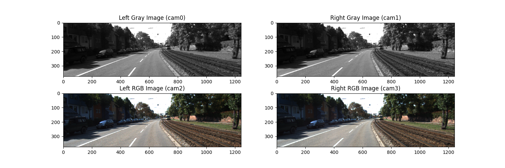

# KITTI Dataset Exploration and VoxelNet Implementation

Take a look at the Kitti Dataset, especially the lidar and camera data and have some fun with it. I will create some useful python visualization functions/notebooks etc. Maybe I will add some explanations e.g. for the coordinate transformation stuff. In addition I have implemented [VoxelNet: End-to-End Learning for Point Cloud Based 3D Object Detection](https://arxiv.org/abs/1711.06396). For details on that, look into `voxelnet`. 

## Example Images

## 3D Bounding Box Visualization

## Lidar Visualization

## TODOs 

* load the model and make predictions -> script 
* evaluation script in python or KITTI eval? 

## References 

Here the helpful stuff I used:

* [pykitti](https://github.com/utiasSTARS/pykitti)
* [KITTI Coordinate Transformations](https://towardsdatascience.com/kitti-coordinate-transformations-125094cd42fb)
* [KITTI Dataset Exploration](https://github.com/navoshta/KITTI-Dataset)
* [QtVisualizer](https://github.com/MarkMuth/QtKittiVisualizer)
* [VoxelNET_PyTorch](https://github.com/Hqss/VoxelNet_PyTorch)
