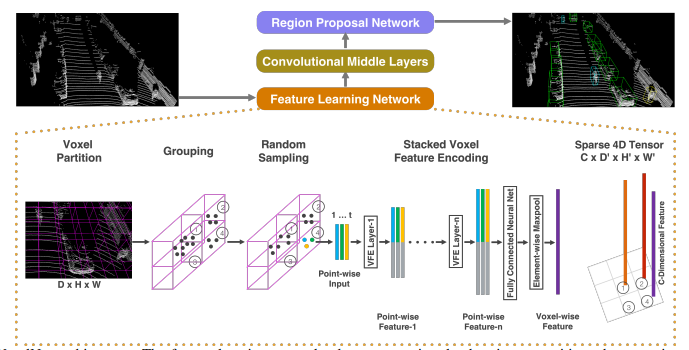

# 3D Object Detection 

- implement a few 3D object detection papers 
- start with VoxelNet (lidar only)
- then one image only
- then a combination 

## VoxelNet 

VoxelNet is a generic lidar-based end-to-end 3D detection framework. 

Three main components:
- Feature Learning Network 
- Convolutional Middle Layers 
- Region Proposal Network 

### Feature Learning Network 

- most important component: **Voxel Feature Encoding** layer 

### Region Proposal Network 

